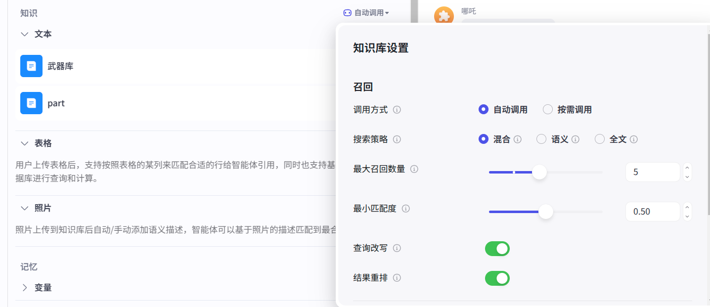

# 任务2：Prompt 与 知识库 —— 联手回答特殊问题

在第三章中，同学们已经学会了如何设计高质量的 Prompt 来唤醒 Agent，为角色打造独特性格并优化对话。现在，我们来分别使用我们刚学会的技能来尝试解决下面的问题：

## 添加知识库

### 问题 1：  
**“经历了这么多的历练，哪吒肯定有很多故事要讲，让我看看你的哪吒会怎样回答我这些问题吧：  1.太乙真人使用七色宝莲给二人重塑肉身，但为什么敖丙后面是附身在你身上？   2.敖丙重塑的肉身在什么情况用力过猛毁掉的？”**
 
**任务 1：**  
- 请设计一个 Prompt，尝试回答上面的问题。  
- 使用你设计的 Prompt 运行 bot，然后记录该回答。
**任务2：**
- 请在任务一的基础上添加对那场大战的描述的知识库。（如果可以，尝试上传大战的画面添加图片知识库）

### 有知识库的加成的回答

### 比较：  
- 请同学们体验两种方式后，对比使用纯 Prompt 和利用知识库方式回答该问题的效果。  
- 记录并讨论总结知识库的优势是什么。

### 联合应用任务

同学们，我们在看看问题二的回答，你发现有没有什么别扭的地方？

谜底揭晓————你发现没有：他的回答不像哪吒的语气，他的回答是不是和我们知识库里添加的内容几乎一模一样呀？
那你们知道了这个问题，你们觉得有什么解决办法吗？

这里介绍使用coze的一种方法：
我们点击这个自动调用，切换为按需调用。

然后我们再到prompt这里，添加对调用知识库回答时语气的描述：

再看看哪吒的回答：

## 对知识库分段

我们现在已经学会了添加知识库了，但同学们，你们在添加的过程中有没有注意到，知识库添加的过程中有个步骤是文档解析策略和分段策略。 
文档解析策略就是区分识别方式是不是多模态；诶，我们这里提到一个概念**多模态**，就是说是不是图文并茂，coze的知识库添加的界面不是有三种文档吗 
分别是文字、表格和图片，如果你添加的文档包含其中的两个即以上，那就是多模态。我们接下来详细讲讲分段策略：

### 分段策略

我们先介绍这里的一些参数的作用（有不懂的直接跳过，完成后面部分后再理解）：

- 分段标识符：我们学习小学语文，老师常常让我们用“//”对课本进行分段，这就是一种分段标识符。在这里我们可以选择任何字符来作为我们的标识符。 比如：我可以用三个“111”来分段，但是注意————我们如果想用文本中原来不存在的字符，我们就需要对文本进行处理，人工在我们认为该分段的地方加上我们的标识符。
- 分段最大长度：就是对课本分段时我们要注意每一段不能太长，不要超过我们规定的这个长度。
- 分段重叠度：先默认，后面再讲
- 文本预处理规则： 将影响分段的字符删除。例如：下面说删除连续的换行符，因为换行符是我们分段的表示符之一，在分段时连续的换行符会出现空的片段。
- 按层级分类：这里的层级指的就是目录，我们按层级分类就类似与我们要根据书的全文来编写最开始的目录页，分段层级就是要分几级目录。

我们现在可以选择喜欢一种方式来对下面的一段文本来进行分段（建议分小组，小组内使用不同分类方式）来让你的哪吒回答我下面的问题： 
文本为同目录下的哪吒2大纲.txt 
问题：

- 没想好
- 没想好

### 总结
 
 根据问题把之前的概念总结，画个思维导图（等该部分内容表达形式确定下后实现）

## 搜索与召回

主要讲图中的内容，最后画个思维导图总结
