# 第九章 - 关卡1：初识Coze插件

> 龙王兴风作浪，哪吒奉命查探天气！但他需要特殊法宝来完成任务...

大家好，小修行者们！今天我们将进入哪吒的法宝训练营，学习使用Coze的神兵利器——**插件**。就像哪吒依靠乾坤圈、混天绫和风火轮这些法宝战胜强敌，Coze机器人也依靠插件获得各种超能力！

想象一下：如果哪吒只有自己的拳脚功夫，没有任何法宝，他能否战胜龙王？恐怕很难！同样地，没有插件加持的Coze机器人，也只能回答一些基础问题，无法执行特殊任务。

## 插件是什么？—— 机器人的神兵法宝

插件就像是哪吒的法宝，每一件都赋予特定的超能力：

| 哪吒法宝 | 法宝能力 | 对应插件类型 | 插件功能 |
|---------|---------|------------|---------|
| 风火轮 | 高速移动，追踪敌人 | 定位/搜索插件 | 快速获取信息，定位资源 |
| 乾坤圈 | 远程攻击，精准打击 | API调用插件 | 从远程服务获取精确数据 |
| 混天绫 | 束缚敌人，控制局面 | 数据处理插件 | 整理信息，格式化输出 |
| 火尖枪 | 攻击敌人，削弱妖怪 | 功能执行插件 | 执行特定任务，解决问题 |

太乙真人（你的老师）会教你如何为哪吒（Coze机器人）装备这些法宝，让他成为无所不能的战士！

## 插件能做什么？—— 法宝的神通广大

### 1. 千里眼顺风耳：获取实时信息
就像哪吒的千里眼能看到远方，插件可以：
- 查询全国各地天气（监控龙王作乱的关键！）
- 获取最新新闻头条
- 了解股票行情变化

> 当你问："上海明天会下雨吗？"——机器人能通过天气插件立即回答！

### 2. 风火轮神通：访问网络资源
就像哪吒踏着风火轮瞬间到达任何地方：
- 搜索互联网上的知识
- 获取特定网页内容
- 查找图片、视频等资源

> 当你说："帮我搜索有关恐龙的信息"——机器人会像风火轮一样快速找到答案！

### 3. 乾坤圈妙用：特殊功能执行
就像哪吒的乾坤圈能变化多端：
- 生成精美图像
- 执行复杂代码
- 计算数学题目

> 当你要求："帮我计算这道数学题：(15×8)÷4="——机器人能精准算出结果！

### 4. 混天绫联通：连接外部服务
就像混天绫能牵连万物：
- 连接邮箱发送信息
- 管理日历和提醒
- 与笔记应用交互

> 当你说："把这条信息发送到我的邮箱"——机器人能通过插件完成任务！

## 插件的种类 —— 法宝的来源

在哪吒的世界中，法宝有不同来源，Coze中的插件也是如此：

1. **官方法宝（官方插件）**：由太乙真人（Coze官方）亲自打造，稳定可靠，如哪吒最初的三大法宝
2. **仙界宝物（社区插件）**：由其他仙人（开发者）创造，功能丰富多样，适合不同场景
3. **自铸神兵（自定义插件）**：你可以像太乙真人一样，打造专属法宝，完全符合你的需求

## 如何给哪吒装备法宝？—— 添加插件

给机器人添加插件就像是教哪吒使用新法宝，需要几个简单步骤：

1. 进入法宝训练场（Coze机器人创建页面）

   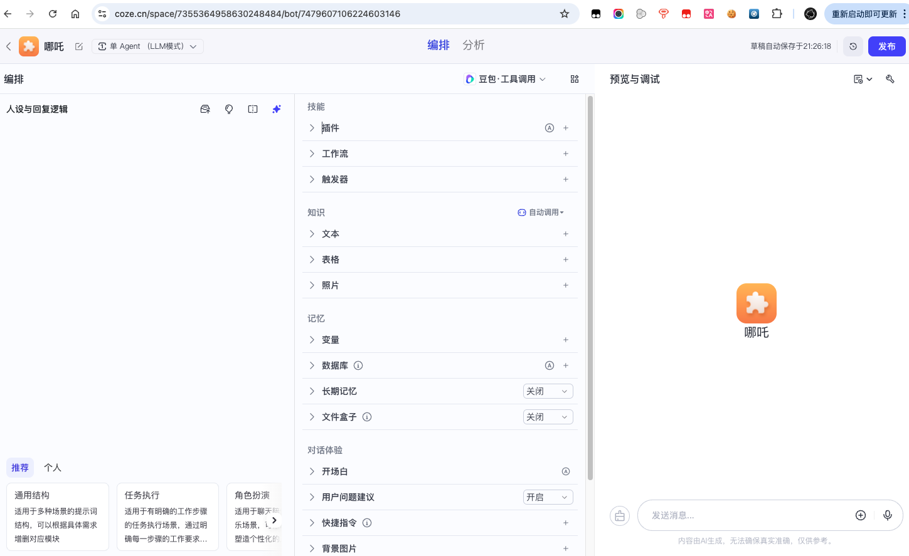

2. 找到法宝库（点击"插件"选项卡）

   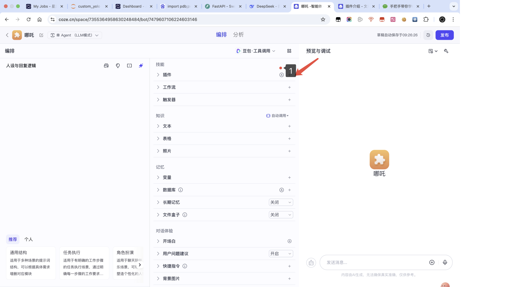

3. 选择心仪的法宝，点击"收入囊中"（添加按钮）

   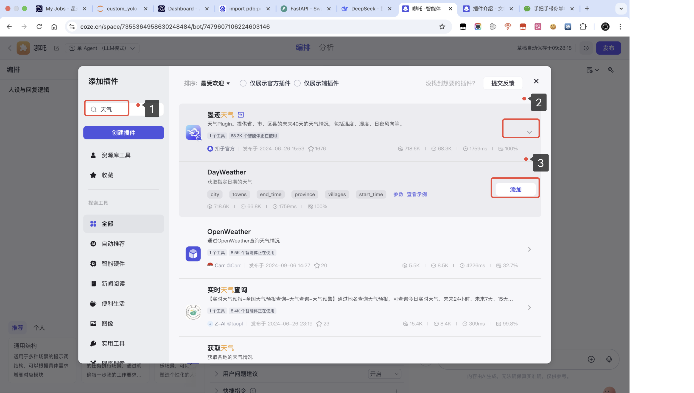

4. 开始使用你的新法宝！

   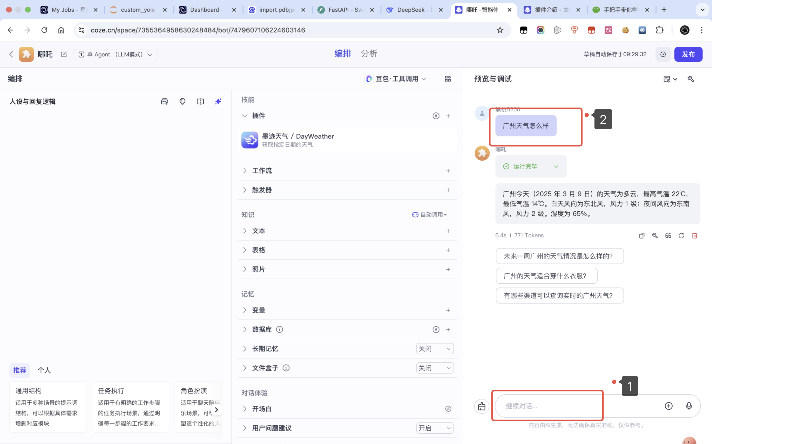

## 法宝驾驭术 —— 工作流中使用插件

现在，让我们像哪吒学习法术一样，亲手操练如何使用插件法宝！

### 步骤1：创建修炼场（工作流）

首先，我们需要布置一个修炼场来演练我们的法宝：

1. 在你的洞府（个人空间页面），找到法术修炼室（工作流）

   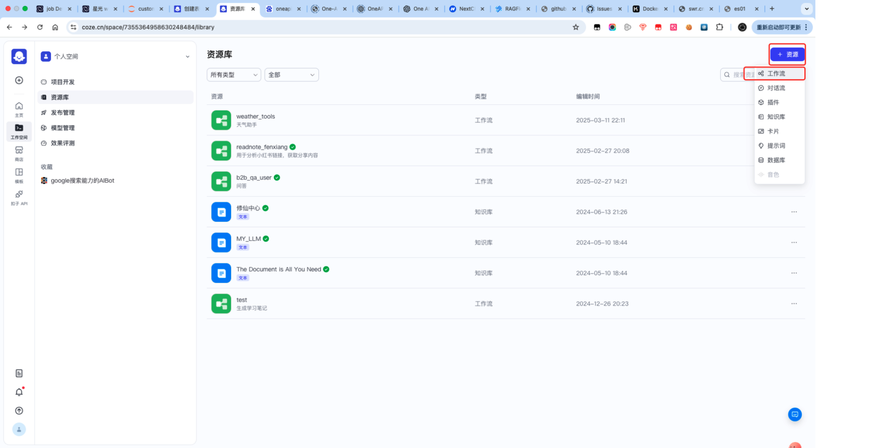

2. 为你的修炼场(工作流)命名（如"天气探查法术"）

   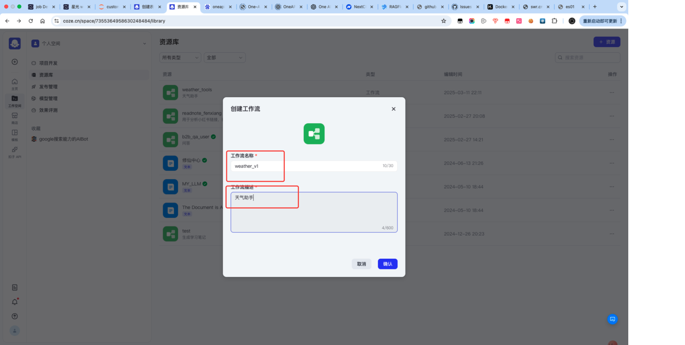

### 步骤2：召唤法宝（添加插件节点）

就像哪吒念动咒语召唤法宝：

1. 在修炼场（工作流）中点击"+"按钮，开始召唤法宝
2. 从法宝类型中选择"插件"（这是最强大的法宝种类！）

   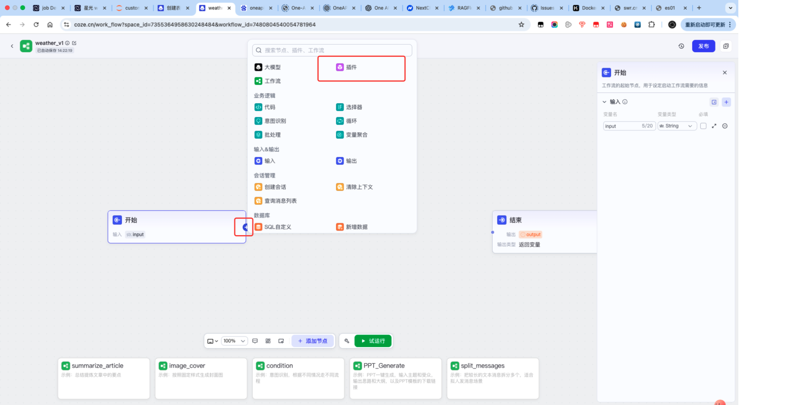

3. 在右侧法宝目录中，寻找"天气探查法宝"（墨迹天气插件）

   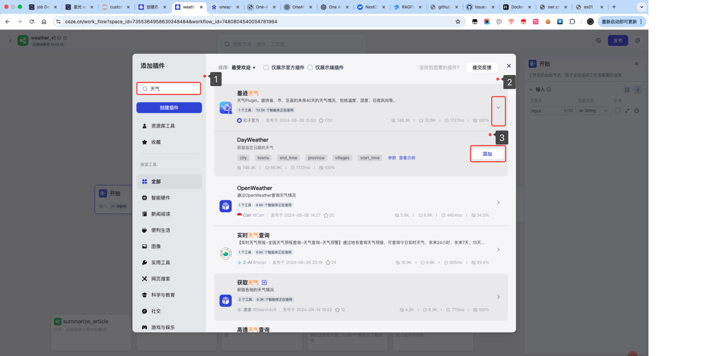

### 步骤3：调整法宝威力（配置插件参数）

就像哪吒学习控制乾坤圈的力道和角度：

1. 在法宝配置面板中，设定要探查的区域（city参数，如"东海"）

   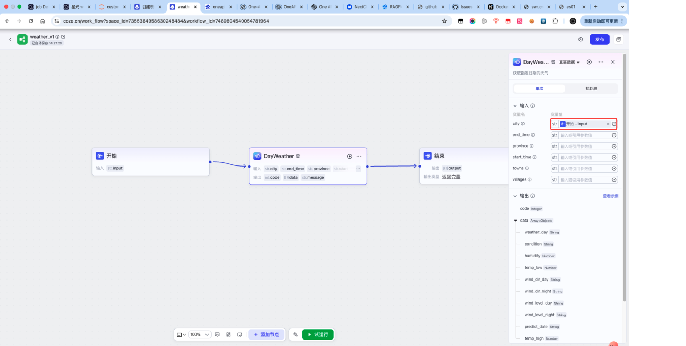

2. 根据需要调整其他参数，如探查的时间范围

### 步骤4：完成法术（连接结束节点）

让法宝发挥作用并展示结果：

1. 从法宝节点牵引灵力（连线）到结果显示点（结束节点）
2. 设置如何展示法宝探查到的信息

   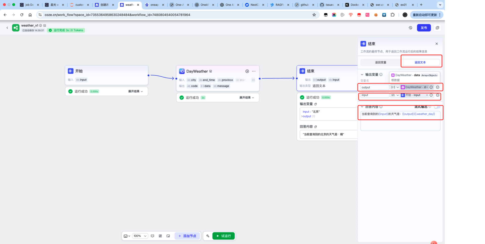

3. 在输出设置中，你可以这样编写展示咒语：
   ```
   天地法眼已探查到{{input}}的天气：{{output[0].weather_day}}
   温度为{{output[0].temp_day}}度，{{output[0].wind_direction}}风{{output[0].wind_power}}级
   ```

### 步骤5：试炼法术（测试我们的"法宝"）

检验我们的天气探查法术是否灵验：

1. 点击"保存"按钮，将法术记录下来
2. 点击"试运行"按钮，开始施法
3. 输入你想探查的地区，如"东海"（龙王可能作乱的地方）
4. 见证法宝的威力！
   
   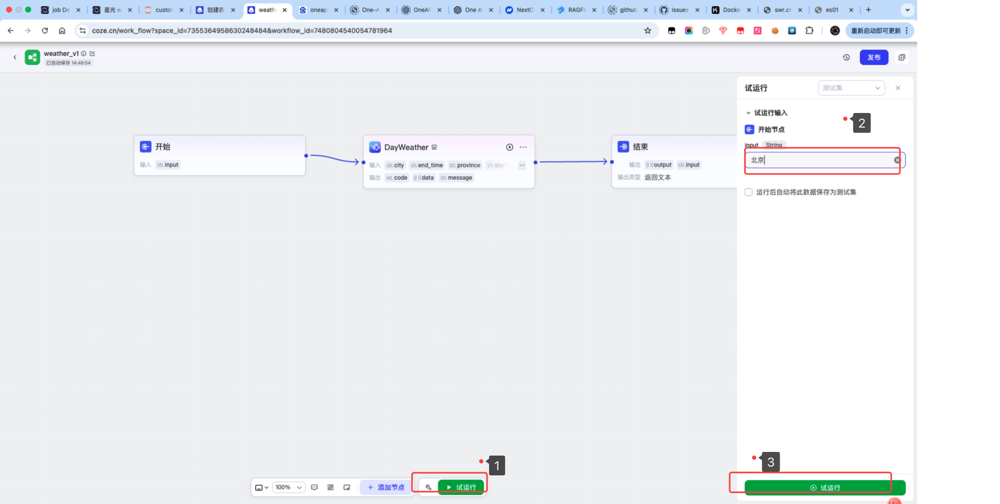

## 法宝组合技 —— 挑战任务

现在你已经掌握了基本法宝使用方法，尝试创建一个"组合法术"：

> **四海探龙术**：同时使用"天气探查法宝"和"搜索法宝"，不仅能查看天气，还能获取该地区的水文信息，帮助哪吒判断龙王是否在兴风作浪！

提示：你需要添加两个插件节点，并设计合理的流程连接它们。

## 修炼总结

今天我们学会了：
1. 理解插件就是Coze的法宝，能赋予机器人特殊能力
2. 认识不同类型的插件及其功能
3. 在工作流中添加和配置插件
4. 创建简单的"天气探查法术"

## 修炼问答

**Q: 为什么有些法宝（插件）需要"法力印记"（API密钥）？**
A: 这些是特别珍贵的法宝，需要特殊的"认主咒语"(API密钥)才能驱动。就像哪吒的法宝认主一样，API密钥确保只有获得授权的人才能使用特定服务。

**Q: 为什么同样的法宝有时会失灵？**
A: 就像哪吒的风火轮在水中速度减慢一样，插件也会受环境影响。可能是网络不稳定，或服务方限制了使用次数，需要等待"法力恢复"。

**Q: 使用法宝（插件）需要付出代价吗？**
A: 基础法宝通常无需代价，但一些强大的法宝可能需要"灵石"（费用）。就像修仙世界中，普通法器随处可得，但神兵利器往往需要付出相应代价。

## 思考题

1. 如果哪吒失去了所有法宝，他该如何应对龙王？同样，如果Coze不能使用插件，它会有哪些局限？

2. 在哪吒的所有法宝中，你认为哪一件最像"天气查询插件"？为什么？

3. 如果你是太乙真人，你会为哪吒打造一件什么样的新法宝（插件）来帮助他监控龙王行踪？这件法宝需要什么参数来控制它的威力？

## 下次预告：寻找天气魔法书

下次课程中，我们将深入探索"天气魔法书"（API文档），学习如何解读咒语结构，获取专属法力印记（API密钥），让哪吒的天气法术威力大增！

---

参考文献：
1. https://mp.weixin.qq.com/s/--Dhc6cz__n-I8mfbmlSpg
2. https://mp.weixin.qq.com/s/OWS55xXFRMek4dVHVX27yA
3. https://www.coze.cn/open/docs/guides/create_plugin