# 第九章 - 关卡2：天气法宝炼制术——寻找天气魔法书

## 哪吒历险：寻找遁天神通

> "四海龙王作乱，兴风作浪！哪吒，你必须掌握'天气遁术'，方能预知各地天象，破解龙王阴谋！"——太乙真人

哪吒接到了太乙真人的紧急任务：四海龙王正在各地兴风作浪，必须收集全国各地的天气情报！但哪吒一人难以同时监察天下万里之遥，太乙真人告诉他："你需要寻得'天气真经'（API文档），炼制一件能观天测地的法宝！"

传说在"百度仙山"有一部天气真经，但这部真经有特殊的符咒格式和重重禁制，需要我们这些法术顾问帮助哪吒破解！

## 天气真经是什么？——认识API

API就像是天庭赐予凡间的神通法术，让我们能够获取超越自身能力范围的信息和能力。天气API相当于一部专门记载天象变化的仙家秘籍。

> **哪吒问道**："师父，为何我不能直接使用这部天气真经？"
>
> **太乙真人答**："此真经乃天庭密语所书，需按'符咒格式'念诵，方能激发神通。如同你的乾坤圈，需掐指诀才能发挥威力！"

### 天气真经的构成：

| 真经组成 | 神话类比 | 实际作用 |
|---------|---------|---------|
| **请求地址** | 仙山洞府入口 | 告诉哪吒去哪里找这部真经 |
| **API密钥** | 入门令牌 | 证明哪吒有资格使用这部真经的凭证 |
| **请求参数** | 法咒中的变量 | 指定想获取哪个城市的天气信息 |
| **返回数据** | 真经显示的天象图 | 包含所需天气信息的回应 |


### 神通比喻：API如同千里眼顺风耳

想象哪吒拜访千里眼顺风耳，请他们帮忙查看远方城市的天气：

1. **传递请求符**（设置参数）：哪吒写下想查看的城市名，交给顺风耳
2. **施展神通**（发送请求）：顺风耳念动咒语，施展神通探查远方
3. **神通感应**（等待响应）：千里眼开始搜寻指定城市的天象
4. **回传天象**（获得数据）：千里眼将看到的天气情况告诉哪吒

这就是API的工作方式：我们发送特定格式的请求，远方的服务接收并处理，然后返回我们需要的信息。

## 炼制天气法宝的修行之路

### 第一步：获取天庭令牌（API密钥）

哪吒首先需要获得一枚特殊的"天庭令牌"，这样才能使用天气真经中的神通。参考[百度地图开放平台注册](/./百度地图开放平台注册.md)完成此步骤。

1. 前往"百度仙山"（[百度天气API](https://lbsyun.baidu.com/apiconsole/key#/home)）
2. 在仙山留下你的姓名（注册账号）
3. 申请"天庭令牌"（创建应用，获取API密钥AK）
4. 妥善保管此令牌，它是开启天气真经的钥匙！

> **哪吒惊讶道**："这令牌竟是一串古怪符文！"
>
> **太乙真人微笑**："正是天庭密文，唯有真经能识别，凡人莫解。"

### 第二步：在洞府中创建法宝雏形（Coze创建插件）

如今哪吒已有天庭令牌，他需要按照太乙真人的指点，开始炼制能够沟通天象的法宝：

1. 进入仙家洞府（Coze平台），寻找法宝炼制室（个人空间->资源库->资源->插件）

   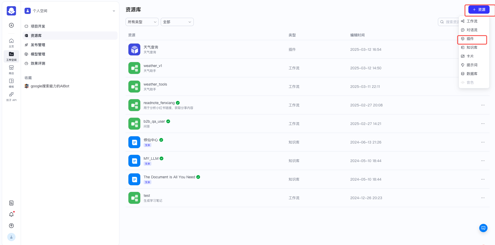

2. 启动炉鼎（点击"创建插件"按钮）

3. 为法宝命名，如"哪吒风雨宝珠"

   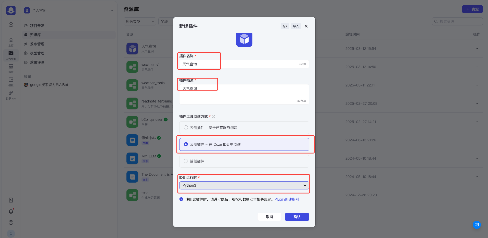

4. 完善法宝基本属性，进入法宝炼制界面

   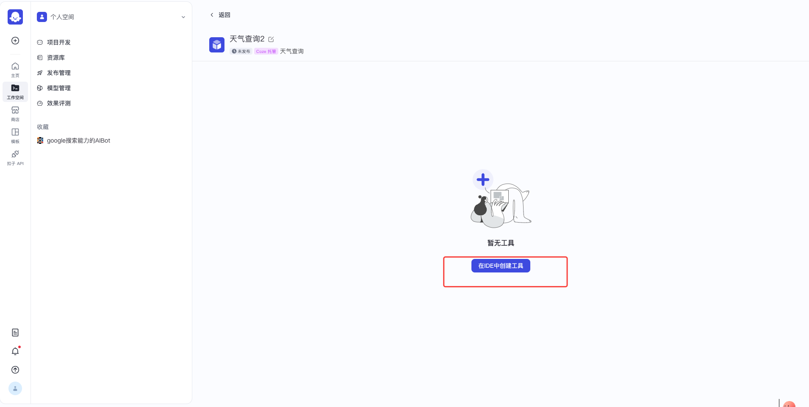

5. 加入辅助仙材（安装requests依赖包）

   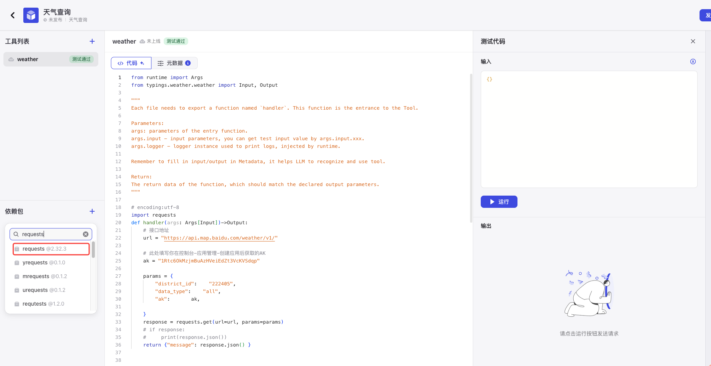

### 第三步：铭刻通灵符文（设置API连接）

哪吒需要在法宝上铭刻特殊符文，让它能够链接天气真经：

1. **符文位置**（请求地址）：天气真经所在的天庭宝库，详见[天庭密藏目录](https://lbsyun.baidu.com/faq/api?title=webapi/weather/base)
   ```
   https://api.map.baidu.com/weather/v1/
   ```

2. **符文参数**：
   - `district_id`：城池代码（哪个城市的天气需探查）
   - `ak`：你的天庭令牌（证明你有权限使用此神通）
   - `data_type`：`all`（获取全部天象信息）

3. 编写天机术语（Python代码），并准备试炼

   > **法术提示**：各大城池代码可查阅[天下城池密码簿](./weather_district_id.csv)，例如天子脚下（北京）代码为110100，东海龙宫附近（上海）代码为310100。

#### 天机术语（Python代码）铭刻

在符文编辑器中，铭刻如下天机术语：

```python
# encoding:utf-8
import requests 

def handler(args: Args[Input])->Output:
    """
    通过天庭密道（API）获取天气神通
    
    参数:
        args.district_id: 城池代码，如"110100"代表天子脚下
        args.ak: 天庭令牌，证明身份用
    
    返回:
        天象图卷（天气数据JSON）
    """
    # 天气真经入口
    url = "https://api.map.baidu.com/weather/v1/"
    
    # 获取符咒参数
    district_id = args.input.district_id
    ak = args.input.ak
    
    # 构建通灵符咒
    params = {
        "district_id": district_id,  # 城池代码
        "data_type": "all",          # 神通范围：now(现在)/fc(预测)/index(指数)/all(全部)
        "ak": ak,                    # 天庭令牌
    }
    
    # 施展通灵术，沟通天气真经
    response = requests.get(url=url, params=params)
    
    # 返回天象卷轴（JSON格式天气数据）
    return {"message": response.json()}
```

#### 试法参数（测试输入）

在试法盘中，输入以下符咒参数：

```python
{
  "district_id": "110100",  # 天子脚下（北京）的城池代码
  "ak": "你的天庭令牌"       # 替换为你获得的真实令牌
}
```

点击"运行"按钮试炼法宝：

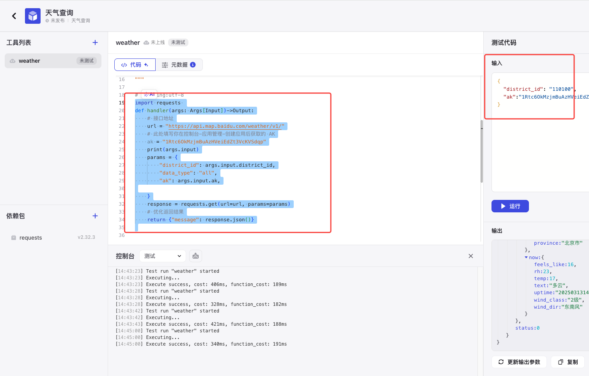

> **哪吒疑惑**："若我的天庭令牌有误会如何？"
>
> **太乙真人警告**："天机不应，神通失效！真经会显示'无效令牌'的警示，须重新获取有效令牌方可继续。"

### 第四步：镌刻法宝属性（配置插件元数据）

试炼成功后，需要为法宝镌刻最终铭文：

1. **法宝功用**：简述此宝功能（如"观天测地，知晓天下雨晴"）
2. **法宝名称**：取一个威力十足的名字（如"哪吒风雨宝珠"）
3. **符咒参数**：定义`district_id`和`ak`两个必要参数
4. **神通效果**：定义输出格式（试炼成功后，可通过"更新输出参数"按钮自动生成）

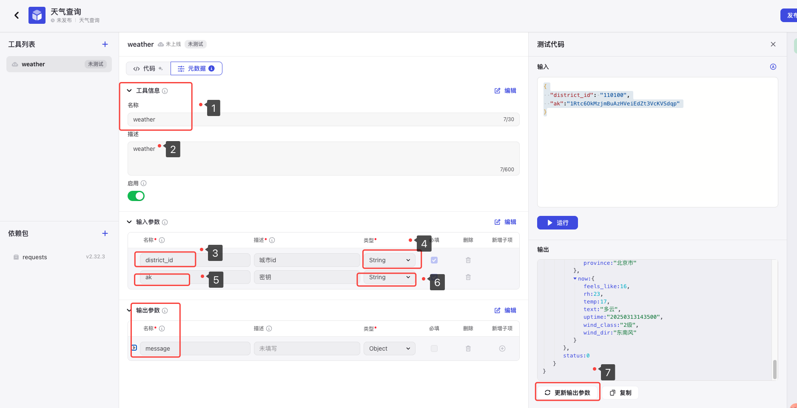

### 第五步：神通成就（发布插件）

确认法宝炼制无误，可以完成最后的封印仪式：

1. 点击右上角的"神通成就"（发布）按钮

   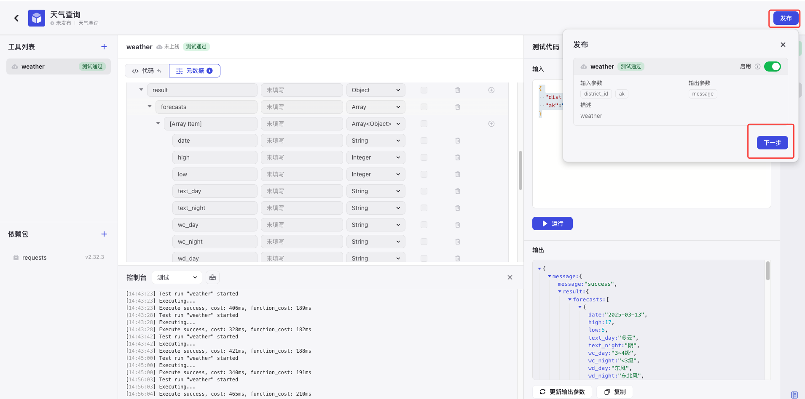

2. 在弹出的天机密令中，"是否收集凡人信息"选择"否"

   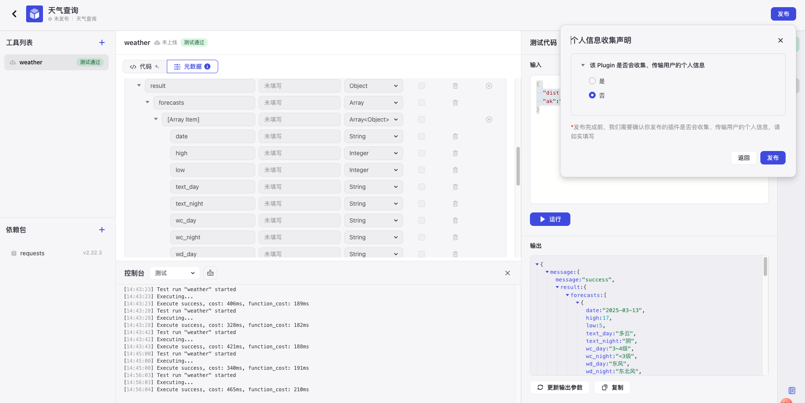

3. 点击确认，完成法宝封印

### 第六步：赐予哪吒法宝（使用插件）

法宝炼制成功，现在可以赐予哪吒使用：

1. 进入"哪吒"机器人的洞府
2. 点击"法宝库" -> "资源法宝"，寻找刚炼制的宝物


3. 将法宝装备给哪吒，赋予他查询天气的神通！

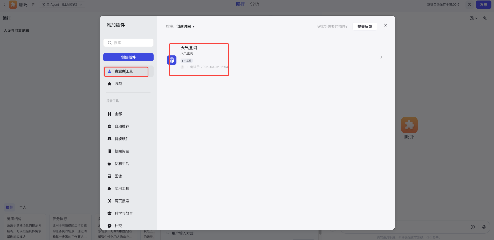

4. 赐予天庭令牌

   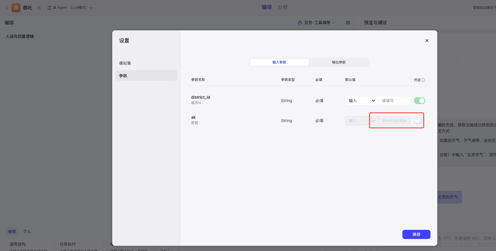

5. 试炼神通，你需要提供要查探的城池代码，可查阅[天下城池密码簿](./weather_district_id.csv)

   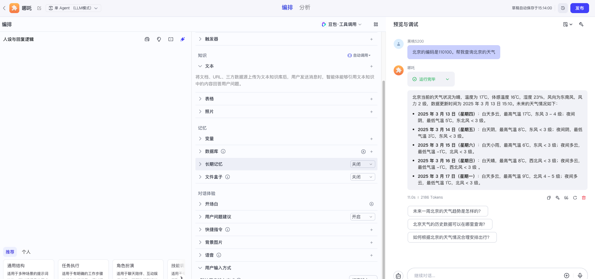

   **思考修炼**：如何只说"北京"，而不用记忆繁复的城池代码，让哪吒直接告诉天气？（下一关我们将学习解决这个问题的神通！）

## 炼丹挑战：天气法师的试炼

太乙真人给你布置了几项试炼任务，完成后你将晋升为"初级天气法师"：

1. **风雨宝珠**：炼制自己的天气法宝，查询你所在城市的天气
2. **明晰天象**：改进法宝符文，让返回的天气信息变得清晰易读（提示：可以整理JSON数据，只保留有用信息）
3. **先知神通**：思考如何让法宝回答"明日雨否？"这类问题（提示：需要分析预报数据）

## 道法总结：API的仙术奥义

通过这次修行，哪吒掌握了"天气遁术"（API），能够观察任何城市的天象变化。太乙真人告诉哪吒，这种神通并非仅限于天气，还可用于：

- 沟通万国语言（翻译API）
- 观星测命（星座运势API）
- 探寻仙界秘藏（百科知识API）
- 甚至御使各种法器（智能家居控制API）

记住，每种API都是一门独特的仙术，只要掌握了正确的符咒（请求格式），便能赋予你的法宝无穷神通！

> **太乙真人欣慰地说**："哪吒，你已初步掌握了'天气遁术'！下一步，我将传授你'转化大法'，让你能读懂普通人的语言，而不再依赖繁复的城池密码！"

## 下次预告：哪吒的语言转换大法

下一关，我们将学习如何让哪吒理解普通人类的语言（如"北京天气如何？"），而不再需要记忆复杂的城池代码。这项神通将大大提升你的法宝实用性！
