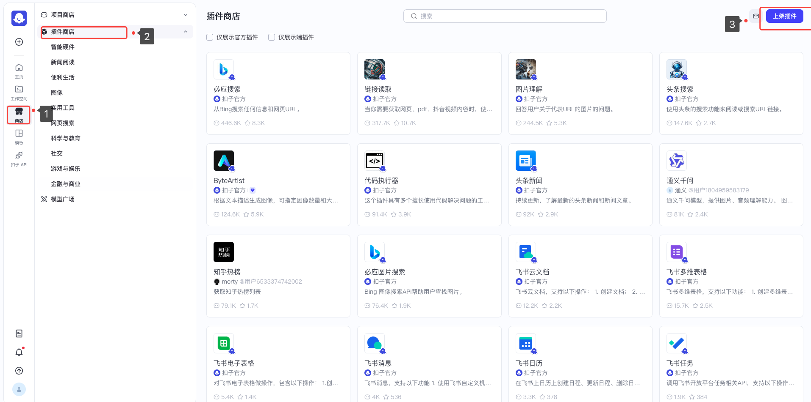
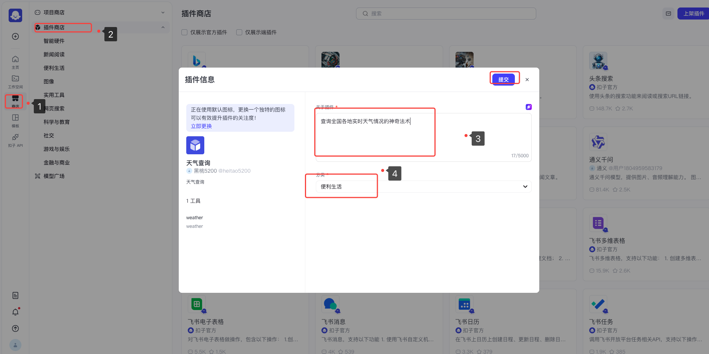
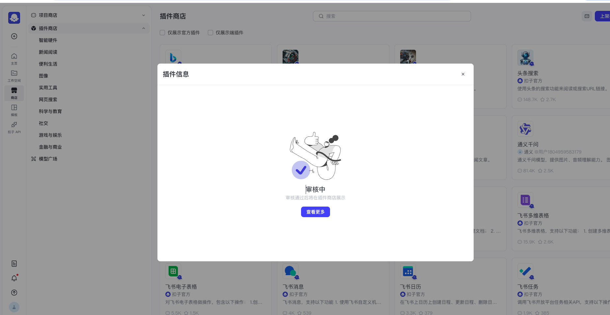
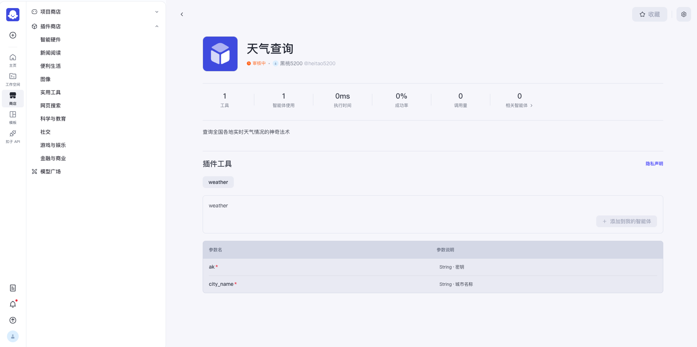

# 第九章 - 关卡4：发布与分享——哪吒的"三界通告"

## 哪吒历险：天庭会议的法术展示

在经过反复测试和优化后，哪吒的天气法术终于完成了！太乙真人非常满意，决定在即将到来的天庭会议上，让哪吒向玉帝和众仙家展示这个神奇的天气法术。

> 太乙真人："哪吒，你的天气法术已经非常完善了。玉帝正为四海龙王的反常举动感到担忧，如果你能在天庭会议上展示这个法术，将有助于监控龙王的动向！"
> 
> 哪吒："但是师父，每次我施展法术，都需要我亲自在场。如果能让其他仙家也能使用这个法术就好了！"
> 
> 太乙真人微笑道："这正是我要教你的最后一课——'法术共享'。将你的法术发布到'三界法术商店'，让所有神仙都能使用它！"

今天，我们将帮助哪吒完成这个最后的任务——将天气法术发布到"三界法术商店"（Coze插件市场），让所有人都能使用这个强大的法术！

## 什么是插件发布？

插件发布就像是将你创造的法术整理成一本详细的法术书，并放入"三界图书馆"让所有人都能借阅使用。这样，其他人不需要知道法术是如何运作的，只需按照说明使用即可。

就像哪吒想把自己的天气法术传授给其他神仙，我们也可以把自己创建的插件分享给其他用户！

## 插件发布的关键步骤

在发布前，需要为插件添加清晰的说明和使用指南：

1. 点击商店->插件商店->上架插件

   

   

2. **填写基本信息**：

   - **关于插件**：简要说明插件功能，如"查询全国各地实时天气情况的神奇法宝"

   - **分类**：方便用户查找

     

3. 提交

   

4. **等待审核**：提交后，插件将进入审核队列，审核通过后将正式发布

  > 哪吒："审核是什么意思？是玉帝要检查我的法宝吗？"
  > 
  > 太乙真人："没错！就像新的法宝需要天庭批准才能正式收录到仙界法宝大全一样，插件也需要平台审核以确保其安全和有效。"




## 设计创意应用场景

好的插件不仅功能强大，还应该有明确的应用场景。哪吒的天气法术可以有多种创意应用：

1. **旅行规划助手**：帮助用户规划旅行行程
   ```
   用户：下周去北京旅游，天气怎么样？
   哪吒天气助手：北京下周温度适宜，多云为主，非常适合参观故宫和长城！记得带防晒霜和舒适的鞋子。
   ```

2. **衣物搭配顾问**：根据天气推荐穿衣策略
   ```
   用户：今天上海要穿什么衣服？
   哪吒天气助手：上海今天温度17°C，多云转小雨，建议穿轻薄外套，带上雨伞会更安心哦！
   ```

3. **农事建议**：为农民提供农作物种植和收获建议
   ```
   用户：明天适合给果园浇水吗？
   哪吒天气助手：明天有雨，不需要额外浇水，可以趁机进行树木修剪工作。
   ```

> 太乙真人："哪吒，好的法术不仅要能施展出来，还要知道在什么场合使用最合适！"
> 
> 哪吒若有所思："我明白了！就像我的乾坤圈和混天绫，每个法器都有最适合的使用场景！"

## 发布注意事项

在发布插件时，务必注意以下隐私和安全事项：

1. **不要在代码中硬编码敏感信息**：如API密钥、密码等
2. **说明数据使用目的**：清楚说明插件收集哪些数据，用于什么目的
3. **最小化数据收集**：只收集必要的数据，不过度索取用户信息
4. **警告潜在风险**：如果插件有任何潜在风险，应在描述中明确提出

## 成果展示

现在，是时候向大家展示你的成果了！就像哪吒在天庭会议上展示他的天气法术一样：

1. **准备演示**：
   - 确保你的插件已经成功发布并添加到机器人中
   - 准备2-3个有代表性的示例问题
   - 思考如何简洁地介绍插件功能

2. **展示技巧**：
   - 先介绍插件解决的核心问题
   - 演示基本功能和特色功能
   - 分享一个创意应用场景
   - 回答观众提问

3. **收集反馈**：
   - 请同学们试用你的插件
   - 收集使用体验和改进建议
   - 思考插件的迭代方向

## 总结：从创意到分享的旅程

通过完成这个关卡，你已经掌握了插件开发的完整流程：从初始创意，到功能实现，再到测试优化，最后发布。这个过程体现了软件开发的基本环节，也是创造性解决问题的典型路径。

> 龙王们见识了哪吒的天气法术后，纷纷惊叹不已。玉帝龙颜大悦，当即宣布："此法术甚是精妙，当纳入仙界法术大全，供三界使用！"
> 
> 哪吒开心地向太乙真人和帮助过他的小伙伴们行了一礼："多谢师父和各位的指导，我终于完成了任务！"
> 
> 太乙真人欣慰地说："记住，哪吒，真正的法术大师不是独自掌握法术的人，而是能将法术分享给更多人造福天下的人！"

恭喜你！你已经帮助哪吒完成了天气法术的全部开发和发布流程。现在，这个法术不仅属于哪吒，也属于所有使用它的人——就像你创造的插件不仅属于你，也属于所有受益于它的用户！


