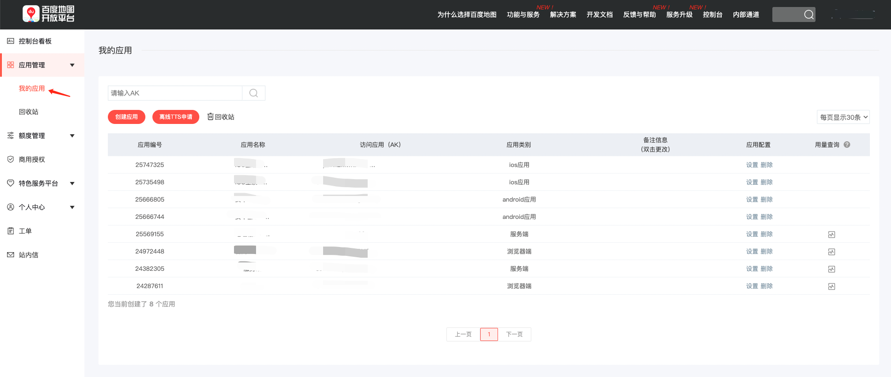

### 使用方法

### 账号注册

1.进入[百度地图开放平台官网](https://lbs.baidu.com/)，点击右上角【登录】按钮，进入百度账号登录页面

2.如您已经拥有百度账号，请通过扫码/用户名验证的方式直接登录；如您还未拥有百度账号请您点击【注册】完成账号注册

3.通过百度账号注册成为百度地图开放平台开发者，选择开发者类型（个人/企业），完成开发者认证即可

### AK秘钥申请

天气API只支持服务端的AK进行接入与访问，请开发者在申请AK时注意选择正确的AK类型。

1. 进入[百度地图开放平台官网控制台](https://lbsyun.baidu.com/apiconsole/center#/home)，点击【应用管理】-【我的应用】

2. 点击【创建应用】进入AK申请页面，填写应用名称，务必选择AK类型为“服务端” 

3. 为了防止您的AK被盗用，请您务必配置refer白名单，只有该白名单中的网站才能成功发起调用。如下方示例所示，配置了*.mysite.com*为域名白名单，即代表域名中包含.mysite.com的网站=才可以使用该AK访问JS API的服务

